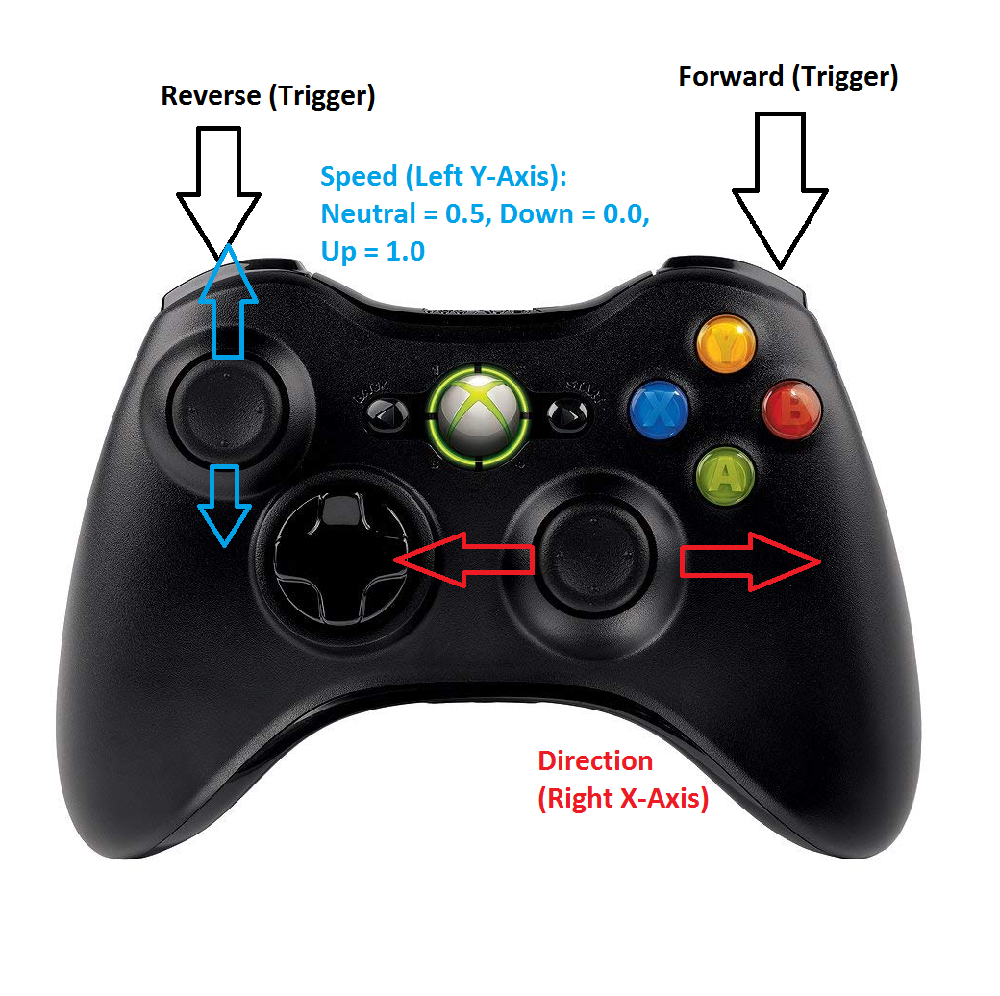

# GTADrive
A better way to drive your robot for the First Robotics Competition.

Currently, almost all control systems in use by FRC teams have speed and direction controlled with one joystick. While this is simple to implement, there is a glaring disadvantage in that it is impossible to allow a driver to control direction at maximum speed. Additionally, it is also difficult with tank or arcade drive systems to easily change direction, and one must always have their hands on a joystick in order to move.

To solve this, we have created a simple class to implement independent drive control to solve these issues, similar to __Grand Theft Auto__'s solution. A driver can control direction with a separate joystick than speed. They can also leave their hand off the left joystick to continue driving at 50% speed. If this is difficult to understand, please refer to the diagram below:

## Diagram

## Using this with your code

To use this drive class with your code, you must have a **DifferentialDrive** somewhere in your subsystem. When you have this, just call the constructor and specify the necessary values: The DifferentialDrive object, the Joystick, and the button numbers/axis numbers for the needed inputs (left y-axis, right x-axis, and both trigger axes).
